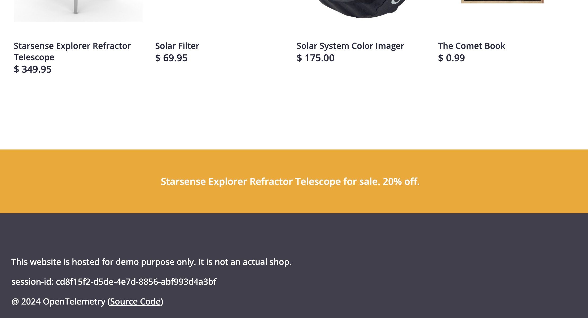
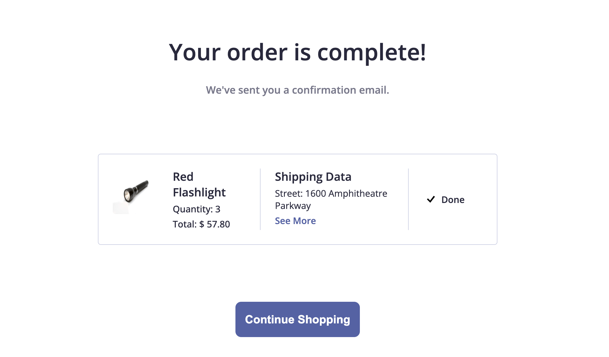
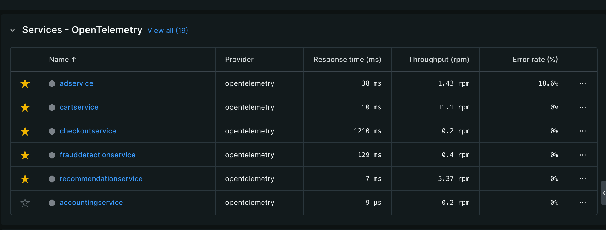

# From Observation to Action: Exploring Debugging with New Relic
With today's workshop, you'll gain an understanding of how observability helps software engineering teams to understand the health and performance of their systems.

Through today's presentation and hands-on exercises, you'll explore observability and will learn how these practices enable engineers to gain insights into the inner workings of their applications, diagnose issues effectively, and make informed decisions to enhance performance and reliability.

## Using New Relic for Debugging
We'll be viewing the data we receive from the Astro Shop application today on New Relic, an all-in-one observability platform that allows us to view telemetry data from different services and infrastructure.

## About OpenTelemetry
OpenTelemetry is an open source framework that's helping us rethink observability at the instrumentation level, by standardizing how our application data is generated, collected, and shipped.

Today we'll be using the OpenTelemetry Astro Shop app to learn about the core pillars of observability. To learn more about OpenTelemetry, check out Reese Lee's workshop, _What's Wrong With My App?: Using OpenTelemetry To Observe Your Code_ on June 14th at 10am.

## Setup Instructions
### First, create your free New Relic account [here](https://newrelic.com/signup).
- If you are currently verified through GitHub Education as a current student, log into your New Relic account and go to **Help > Resources > New Relic for Students > Manage Account Eligibility > GitHub Education** to allow New Relic to verify your student status. Additional data and ingest from the [New Relic for Students](https://newrelic.com/students) program will be automatically added to your account.
- If you're not currently registered as a GitHub Education student, please go [here](https://education.github.com/pack) to sign up. Once you've been successfully verified as a student, you'll be able to follow the steps above to receive the New Relic for Students Benefits.

### Fork this repository! (Please do not clone)
- Click on `Code`, then `Create Codespace on main`
### Add your New Relic license key to your application
- In your New Relic account, click on your name, then click on API Keys
- Under Type, find the key that says `INGEST - LICENSE`, click on the three dots at the end of the row, and click `Copy key`
- Paste your New Relic license key in the `otel-config-extras.yml` file under `exporters: api key`

You're ready to run your application!
## Running the application
Run the `make start` command.

## Stopping the application
Stop the Codespace under `code`

## The Task
I'm looking to purchase some items and have them delivered in time for the next meteor shower this year so I can see all of the shooting stars! However, as I navigate the application, I am noticing that special deals are not being applied to select items, and I am not getting the correct total as I go to complete my purchase. I want to use New Relic and view the data that is coming in from the application so I can fix the bugs and have my order shipped.

### Step 1: Add items
Choose any 2 items from the Astro Shop and add them to your cart. For your second item, add multiple quantities of the items.

### Step 2: Add item from an ad
Scroll to the bottom of an item's information page, you should see an ad for a discount off of one item. Click on the ad and then add that item to your cart.

### Step 3: Proceed to checkout
Feel free to enter whatever shipping information you want, or keep what's there. Enter the following card information under Payment Method:
- Credit Card Number: 4432-8015-6152-0453
- Expiration Date: January 2028
- Security Code: 060

### Step 4: Click on Place Order

This is the page that I should see after I click the Place order button.

### Step 5: Check your New Relic account
 In your New Relic account, you should see a list of 19 services with `opentelemetry` listed as the provider. This is how you know you've instrumented your application with New Relic correctly.

If you don't see this data appear in your New Relic account within a few minutes, review the setup instructions.

## Today's Scenario

I want to order a new telescope and some items for the next meteor shower this summer. I'm going to explore the data coming from our applications into the New Relic platform to see if I can find out what's causing the problem. I'm going to explore our services, and show you how metrics, logs, and traces can help us figure out what's occuring with our systems and why.

### Understanding Metrics
New Relic has a feature called the Metrics Explorer that allows us to build queries to see how our application is performing.

I'm curious about the amount of traffic coming to the website, so I want to see how many requests are being made to the frontend service over the last 30 minutes.

To follow along:
- Click on `frontend` under `Services - Opentelemetry`
- Click on `Metrics Explorer`
- Click on `app.frontend.requests` to see the total number of requests made to the frontend in the last 30 minutes
- You can also hover over the built query `SELECT sum(`app.frontend.requests`) FROM Metric WHERE `entity.guid` = 'MzQ5NzQ5NHxFWFR8U0VSVklDRXwtOTE1NDc5Mjc1MTAxMTIzODUxMA' SINCE 30 MINUTES AGO TIMESERIES` and click on `Build in...` to create your own query.
- If you choose the second option to see the data, you can run the query `SELECT sum(`app.frontend.requests`) FROM Metric WHERE `entity.name` = 'frontend' SINCE 30 MINUTES AGO TIMESERIES`. You can also change the time to 1 hour ago, 3 days ago, and 7 days ago.

### Viewing Logs
Let's get back to figuring out what's going on with my order. Let's check out the cart service and see 

### Checking Out Traces
It looks like the error rate is up on the Checkout service. I want to first, think about all of the services that would work with the checkout service, and think about where the issue might be. Looking at the Service Map in the Checkout service is a great place to start. It's going to take some time to look through all of these services, especially since we know that each of the services, while experiencing their own issues, may not be affecting the checkout process. 

New Relic actually has a feature called the **Errors inbox**, where I can get information from a trace if an error has occurred.

Once I click on Errors Inbox, I see the Triage tab. Under the tab, I see that there is one error under `grpc.oteldemo.PaymentService/Charge,` once I click on this link, I can see the Error message that states that the credit card information is invalid.

If you go to `loadgenerator/persons.json`, you'll see a list of valid credit card numbers that work for today's workshop. Choose a credit card number and press Place Order again, where you'll finally see the order confirmation page.

## Resources
[Get Started with New Relic](https://docs.newrelic.com/docs/new-relic-solutions/get-started/intro-new-relic/)

[Getting Started with APM](https://docs.newrelic.com/docs/apm/new-relic-apm/getting-started/introduction-apm/)

[Introduction to OpenTelemetry with New Relic](https://docs.newrelic.com/docs/more-integrations/open-source-telemetry-integrations/opentelemetry/opentelemetry-introduction/)

[New Relic for Students](https://newrelic.com/students)
